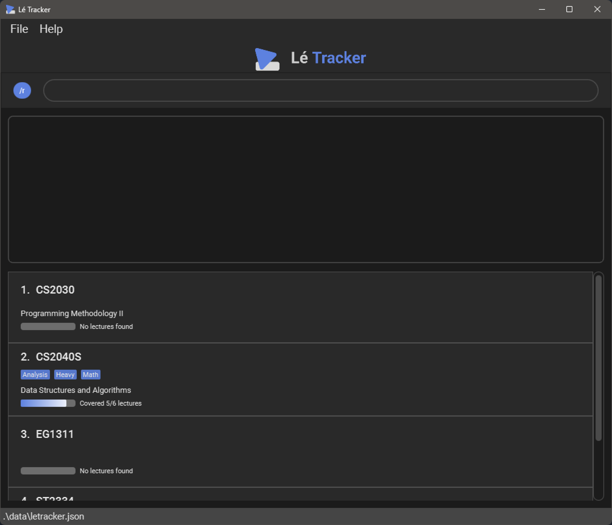

**Le Tracker** is a desktop application that focuses on tracking lecture watch progress. Designed for NUS students who are fast typists, it seeks to address the problem of students losing track of their watch progress, especially for students falling behind on multiple lectures.

Unlike a traditional to-do list app, **Le Tracker** is tailored to meet these needs by providing features such as the ability view the overall lecture progress of a module and the ability to tag each lecture with keywords (such as the topic or difficulty of the lecture) that allow for easy filtering when prioritising. These features help students stay organized and keep track of their progress more effectively.

While it has a GUI, most of the user interactions happen using a CLI (Command Line Interface).

- If you are interested in using **Le Tracker**, head over to the [_Quick Start_ section of the **User Guide**](UserGuide.md#quick-start).
- If you are interested about developing **Le Tracker**, the [**Developer Guide**](DeveloperGuide.md) is a good place to start.

### Acknowledgements

- Forked from: [AddressBook Level-3](https://github.com/nus-cs2103-AY2223S2/tp)
- Libraries utilised: [Jackson](https://github.com/FasterXML/jackson), [JavaFX](https://openjfx.io/), [JUnit 5](https://junit.org/junit5/)
- Tools utilised: [Gradle](https://gradle.org/)
